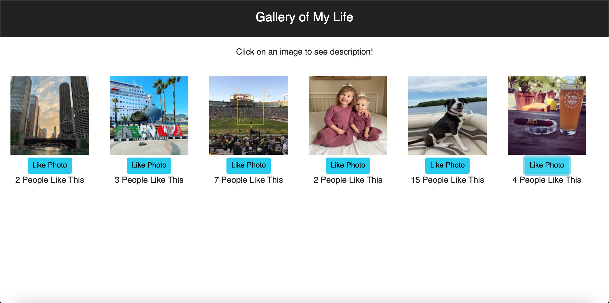

# React Gallery

## Description

_Duration: 1 Week_

In this project a user can view images on the screen. The user can click on each image and a description of that image will appear. If the user clicks on the description, the image will then reappear. A [Like Photo] button is below each image. A user can click the [Like Photo] button which in turn will increment the Like count by one.

The data is stored locally in an array found within `modules/gallery.data.js`.

## Screen Shot

### Prerequisites

- [Node.js](https://nodejs.org/en/)

## Installation

1. Fork and clone project to local computer
2. Open with the editor of your choice
3. Add a few images to the `public/images` folder and modify the `server/modules/gallery.data.js` file
4. Install nodemon `npm install nodemon --global`
5. `npm install`
6. `npm run server`
7. Open a new terminal tab and run `npm run client`
8. Nodemon will automatically spin client and server side automatically when changes are made
9. Control + C to stop server or client in their respected terminal

## Usage

1. On page load, six images will appear
2. Click on any image and a description will appear in place of image
3. Click on description and the image will then reappear
4. If user enjoys an image they can click on the [Like Photo] button
5. Users can see how many people have liked an image

## Built With

- React
- Node.js
- Express.js
- Javascript
- Bootstrap
- HTML
- CSS

## Acknowledgement

Thanks to Prime Digital Academy who equipped and helped me to make this application a reality.

## Support

If you have suggestions or issues, please email me at terry.okeefe87@gmail.com